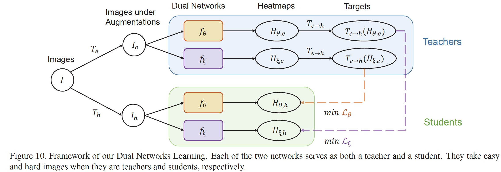

# An Empirical Study of the Collapsing Problem in Semi-Supervised 2D Human Pose Estimation (ICCV 2021)


## Introduction
This is an official pytorch implementation of [*An Empirical Study of the Collapsing Problem in Semi-Supervised 2D Human Pose Estimation*](https://arxiv.org/abs/2011.12498). [ICCV 2021] [PDF](https://arxiv.org/abs/2011.12498)

   

## Abstract
Most semi-supervised learning models are **consistency-based**, which leverage unlabeled images by maximizing the similarity between different augmentations of an image. But when we apply them to human pose estimation that has **extremely imbalanced class distribution**, they often **collapse** and **predict every pixel in unlabeled images as background**. We find this is because the decision boundary passes the high-density areas of the minor class so more and more pixels are gradually mis-classified as background.

In this work, we present a surprisingly simple approach to drive the model. For each image, it composes **a pair of easy-hard augmentations** and uses the more accurate predictions on the easy image to teach the network to learn pose information of the hard one.  The **accuracy superiority** of teaching signals allows the network to be “monotonically” improved which effectively **avoids collapsing**. We apply our method to the state-of-the-art pose estimators and it further improves their performance on three public datasets.

## Main Results
### 1. Semi-Supervised Setting
Results on COCO Val2017
| Method | Augmentation | 1K Labels | 5K Labels | 10K Labels | 
|---|---|---|---|---|
| Supervised | Affine | 31.5 | 46.4 | 51.1 |
| PoseCons (Single) | Affine   | 38.5 | 50.5 | 55.4 | 
| PoseCons (Single) | Affine + Joint Cutout  | 42.1 | 52.3 | 57.3 | 
| PoseDual (Dual) | Affine   | 41.5 | 54.8 | 58.7 | 
| PoseDual (Dual) | Affine + RandAug  | 43.7 | 55.4 | 59.3 | 
| PoseDual (Dual) | Affine + Joint Cutout  | **44.6** |**55.6** | **59.6** |

We use COCO Subset (1K, 5K and 10K) and TRAIN as labeled and unlabeled datasets, respectively


### Note:

- The Ground Truth person boxes is used 
- No flipping test is used.

### 2. Full labels Setting
Results on COCO Val2017
| Method | Network | AP| AP.5 | AR | 
|---|---|---|---|---|
| Supervised | ResNet50 | 70.9 | 91.4 | 74.2 | 
| PoseDual | ResNet50   | **73.9 (↑3.0)** | 92.5 | 77.0|
| Supervised | HRNetW48 | 77.2 | 93.5 | 79.9 |
| PoseDual | HRNetW48   | **79.2 (↑2.0)**  | 94.6 | 81.7

We use COCO TRAIN and WILD as labeled and unlabeled datasets, respectively

## Pretrained Models 
Download Links
[Google Drive](https://drive.google.com/drive/folders/1mDawjbsRawrr8ehPWtSqLXowstEN6ah_?usp=sharing)

## Environment
The code is developed using python 3.7 on Ubuntu 16.04. NVIDIA GPUs are needed. 

## Quick start
### Installation
1. Install pytorch >= v1.2.0 following [official instruction](https://pytorch.org/).
2. Clone this repo, and we'll call the directory that you cloned as ${POSE_ROOT}.
3. Install dependencies:
   ```
   pip install -r requirements.txt
   ```
4. Make libs:
   ```
   cd ${POSE_ROOT}/lib
   make
   ```
5. Init output(training model output directory)::
   ```
    mkdir output 
    mkdir log
   ```

6. Download pytorch imagenet pretrained models from [Google Drive](https://drive.google.com/drive/folders/1VxaLZK5D6mlgrq3Z_MZweITBHKrqaVGe?usp=sharing). 
The PoseDual (ResNet18) should load resnet18_5c_gluon_posedual as pretrained for training,

7. Download our pretrained models from [Google Drive](https://drive.google.com/drive/folders/1mDawjbsRawrr8ehPWtSqLXowstEN6ah_?usp=sharing)

   ```
   ${POSE_ROOT}
    `-- models
        `-- pytorch
            |-- imagenet
            |   |-- resnet18_5c_f3_posedual.pth
            |   |-- resnet18-5c106cde.pth
            |   |-- resnet50-19c8e357.pth
            |   |-- resnet101-5d3b4d8f.pth
            |   |-- resnet152-b121ed2d.pth
            |   |-- ......
            |-- pose_dual
                |-- COCO_subset
                |   |-- COCO1K_PoseDual.pth.tar
                |   |-- COCO5K_PoseDual.pth.tar
                |   |-- COCO10K_PoseDual.pth.tar
                |   |-- ......
                |-- COCO_COCOwild
                |-- ......
   ```
   
### Data preparation
For COCO and MPII dataset, Please refer to [Simple Baseline](https://github.com/microsoft/human-pose-estimation.pytorch) to prepare them.  
Download [Person Detection Boxes](https://drive.google.com/drive/folders/15bx9WFb9zBPhFrL3foQVZSn0kT8r4Hvz?usp=sharing) and [Images](http://images.cocodataset.org/zips/unlabeled2017.zip) for COCO WILD (unlabeled) set. 
The structure looks like this:
```
${POSE_ROOT}
|-- data
`-- |-- coco
    `-- |-- annotations
        |   |-- person_keypoints_train2017.json
        |   |-- person_keypoints_val2017.json
        |   `__ image_info_unlabeled2017.json
        |-- person_detection_results
        |   |-- COCO_val2017_detections_AP_H_56_person.json
        |   |-- COCO_test-dev2017_detections_AP_H_609_person.json
        |   `-- COCO_unlabeled2017_detections_person_faster_rcnn.json
        `-- images
            |-- train2017
            |   |-- 000000000009.jpg
            |   |-- 000000000025.jpg
            |   |-- ... 
            `-- val2017
                |-- 000000000139.jpg
                |-- 000000000285.jpg
                |-- ... 
```

For AIC data, please download from [AI Challenger 2017](https://github.com/AIChallenger/AI_Challenger_2017), 2017 Train/Val is needed for keypoints training and validation. Please download the annotation files from [AIC Annotations](https://drive.google.com/drive/folders/1fA9CrMnR9QgutBSJ8hcdRi-2mIWZLR8T?usp=sharing).
The structure looks like this:

```
${POSE_ROOT}
|-- data
`-- |-- ai_challenger
    `-- |-- train
        |   |-- images
        |   `-- keypoint_train_annotation.json
        `-- validation
            |-- images
            |   |-- 0a00c0b5493774b3de2cf439c84702dd839af9a2.jpg
            |   |-- 0a0c466577b9d87e0a0ed84fc8f95ccc1197f4b0.jpg
            |   `-- ...
            |-- gt_valid.mat
            `-- keypoint_validation_annotation.json
```

## Run 
### Training
### 1. Training Dual Networks (PoseDual) on COCO 1K labels

```
python pose_estimation/train.py \
    --cfg experiments/mix_coco_coco/res18/256x192_COCO1K_PoseDual.yaml
```

### 2. Training Dual Networks on COCO 1K labels with Joint Cutout

```
python pose_estimation/train.py \
    --cfg experiments/mix_coco_coco/res18/256x192_COCO1K_PoseDual_JointCutout.yaml
```

### 3.Training Dual Networks on COCO 1K labels with Distributed Data Parallel

```
python -m torch.distributed.launch --nproc_per_node=4  pose_estimation/train.py \
    --distributed --cfg experiments/mix_coco_coco/res18/256x192_COCO1K_PoseDual.yaml
```

### 4. Training Single Networks (PoseCons) on COCO 1K labels

```
python pose_estimation/train.py \
    --cfg experiments/mix_coco_coco/res18/256x192_COCO1K_PoseCons.yaml
```

### 5. Training Dual Networks (PoseDual) with ResNet50 on COCO TRAIN + WILD

```
python pose_estimation/train.py \
    --cfg experiments/mix_coco_coco/res50/256x192_COCO_COCOunlabel_PoseDual_JointCut.yaml
```

### Testing
### 6. Testing Dual Networks (PoseDual+COCO1K) on COCO VAL

```
python pose_estimation/valid.py \
    --cfg experiments/mix_coco_coco/res18/256x192_COCO1K_PoseDual.yaml
```

## Citation
If you use our code or models in your research, please cite with:
```
@inproceedings{semipose,
  title={An Empirical Study of the Collapsing Problem in Semi-Supervised 2D Human Pose Estimation},
  author={Xie, Rongchang and Wang, Chunyu and Zeng, Wenjun and Wang, Yizhou},
  booktitle={ICCV},
  year={2021}
}
```
## Acknowledgement
The code is mainly based on [Simple Baseline](https://github.com/microsoft/human-pose-estimation.pytorch) and [HRNet](https://github.com/leoxiaobin/deep-high-resolution-net.pytorch).
Some code comes from [DarkPose](https://github.com/ilovepose/DarkPose). Thanks for their works.
